# 🔐 login
## MVC 2편(김영한)
**목표: Login 기능을 구현**

### 로그인 요구사항
* 홈 화면 - 로그인 전
  * 회원 가입
  * 로그인
* 홈 화면 - 로그인 후
  * 본인 이름(누구님 환영합니다.)
  * 상품 관리
  * 로그 아웃
* 보안 요구사항
  * 로그인 사용자만 상품에 접근하고, 관리할 수 있음
  * 로그인 하지 않은 사용자가 상품 관리에 접근하면 로그인 화면으로 이동
* 회원 가입, 상품 관리

### 홈화면
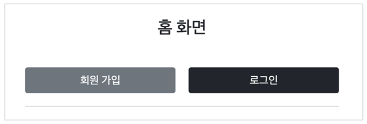

### 로그인 성공
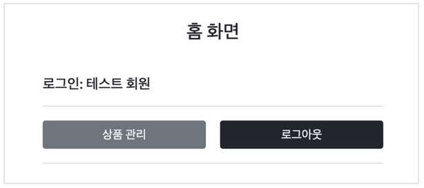

### 회원 가입
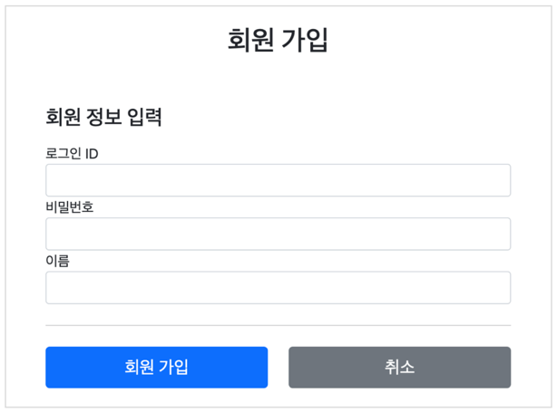

### 로그인
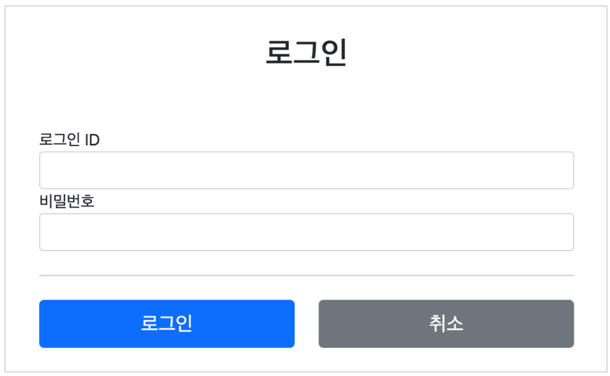

### 상품 목록
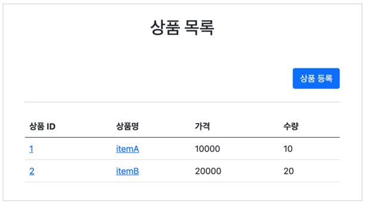


### 패키지 구조 설계
**package 구조**
* hello.login
  * domain
    * item
    * member
    * login
  * web
    * item
    * member
    * login
---
### 도메인이 가장 중요하다!!!!

> **`web`의 죽음을 `domain`에게 알리지 마라..!**

`domain`은 화면, UI, 기술 인프라 등등의 영역을 제외한 시스템이 구현해야하는 `핵심 비즈니스 업무 영역`을 말함

향후 `web`을 다른 기술로 바꾸어도 `domain`은 그대로 유지할 수 있어야 한다.

이렇게 하려면 `web`은 `domain`을 알고있지만, `domain`은 `web`을 모르도록 설계 해야한다.

이것을 `web`은 `domain`을 의존하지만, `domain`은 `web`을 의존하지 않는다고 표현한다.

예를 들어 `web` 패키지를 모드 삭제해도 `domain`에는 전혀 영향이 없도록 의존관계를 설계하는 것이 중요하다.

즉, **`domain`은 `web`을 참조하면 안된다.!**

---

### 로그인 처리하기 -세션 직접 만들기
🧑‍💻 세션을 직접 개발해서 적용해보자!!

세션 관리는 크게 다음 3가지 기능을 제공하면 된다.

* 세션 생성
  * `sessionId` 생성(임의의 추청 불가능한 🎲랜덤 값)
  * 세션 저장소에 `sessionId` 와 보관할 값 저장
  * `sessionId` 로 응답 쿠키를 생성해서 클라이언트에 전달
* 세션 조회
  * 클라이언트가 요청한 `sessionId` 쿠키의 값으로, 세션 저장소에 보관한 값 조회
* 세션 만료
  * 클라이언트가 요청한 `sessionId` 쿠키의 값으로, 세션 저장소에 보관한 `sessionId` 와 값 제거

**SessionManager -세션관리**
```java
@Component
public class SessionManager {
    private Map<String, Object> sessionStore = new ConcurrentHashMap<>();
    public static final String SESSION_COOKIE_NAME = "mySessionId";

    /**
     * 세션 생성
     * * sessionId 생성 (임의의 추정 불가능한 랜덤 값)
     * * 세션 저장소에 sessionId와 보관할 값 저장
     * * sessionId로 응답 쿠키를 생성해서 클라이언트에 전달
     */
    public void createSession(Object value, HttpServletResponse response) {

        //sessionId 생성, 값을 세션에 저장
        String sessionId = UUID.randomUUID().toString();
        sessionStore.put(sessionId, value);

        //쿠키 생성
        Cookie mySessionCookie = new Cookie(SESSION_COOKIE_NAME, sessionId);
        response.addCookie(mySessionCookie);
    }

    /**
     * 세션 조회
     */
    public Object getSession(HttpServletRequest request) {
//        Cookie[] cookies = request.getCookies();
//        if (cookies == null) {
//            return null;
//        }
//        for(Cookie cookie : cookies) {
//            if(cookie.getName().equals(SESSION_COOKIE_NAME)) {
//                return sessionStore.get(cookie.getValue());
//            }
//        }
//        return null;
        Cookie sessionCookie = findCookie(request, SESSION_COOKIE_NAME);
        if(sessionCookie == null) {
            return null;
        }
        return sessionStore.get(sessionCookie.getValue());
    }

    /**
     * 세션 만료
     */
    public void expire(HttpServletRequest request) {
        Cookie sessionCookie = findCookie(request, SESSION_COOKIE_NAME);
        if(sessionCookie != null) {
            sessionStore.remove(sessionCookie.getValue());
        }
    }

    public Cookie findCookie(HttpServletRequest request, String cookieName) {
        Cookie[] cookies = request.getCookies();
        if (cookies == null) {
            return null;
        }
        return Arrays.stream(cookies)
                .filter(c -> c.getName().equals(cookieName))
                .findAny()
                .orElse(null);
    }
}
```

**SessionManagerTest -세션관리 테스트**

`HttpServletRequest`, `HttpServletResponse` 객체를 직접 사용할 수 없기 때문에,

테스트에서 비슷한 역할을 해주는 가짜 `MockHttpServletRequest`, `MockHttpServletResponse` 를 사용
```java
class SessionManagerTest {
    SessionManager sessionManager = new SessionManager();

    @Test
    void sessionTest() {
        
        //세션 생성(서버에서 클라이언트로)
        MockHttpServletResponse response = new MockHttpServletResponse();
        Member member = new Member();
        sessionManager.createSession(member, response);

        //요청에 응답 쿠키 저장(클라이언트에서 서버로)
        MockHttpServletRequest request = new MockHttpServletRequest();
        request.setCookies(response.getCookies());

        //세션 조회
        Object result = sessionManager.getSession(request);
        Assertions.assertThat(result).isEqualTo(member);

        //세션 만료
        sessionManager.expire(request);
        Object expired = sessionManager.getSession(request);
        Assertions.assertThat(expired).isNull();
    }
}
```

**동작 방식**

* **로그인**
  * 사용자가 `loginId`, `password` 정보를 전달하면서 서버에서 해당 사용자가 맞는지 확인 

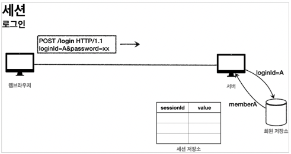

* **세션 생성**
  * 세션 ID를 생성(추정 불가능 해야함)
  * UUID 사용
    * `Cookie: mySessionId=zz0101xx-bab9-4b92-9b32-dadb280f4b61`

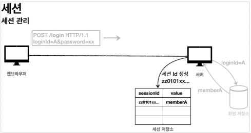

* **세션 id를 쿠키로 전달**
  * 클라이언트롸 서버는 결국 쿠키로 연결되어야함.(세션ID를 사용하여 느슨한 관계 유지)
  * 서버는 클라리언트에 `mySessionId` 라는 이름으로 세션 ID만 `쿠키`에 담아서 전달
  * 클라이언트는 `쿠키` 저장소에 `mySessionId` 쿠키를 보관

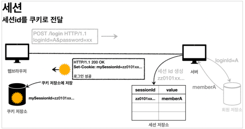

* **클라이언트의 세션 id 쿠키 전달**
  * 클라이언트는 요청시 항상 `mySessionId` 쿠키를 전달한다.
  * 서버에서는 클라이언트가 전달한 `mySessionId` 쿠키 정보로 세션 저장소를 조회해서 로그인시 보관한 세션 정보를 사용

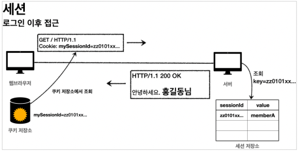

* 정리
  * 쿠키 값을 변조 가능 
    * 예상 불가능한 복잡한 세션 Id를 사용
  * 쿠키에 보관하는 정보는 클라이언트 해킹시 훔칠 가능성
    * 세션 Id를 도둑 맞아도 여기에는 중요한 정보가 없음
  * 쿠키 탈취 후 사용 
    * 해커가 토큰을 훔쳐가도 시간이 지나면 사용할 수 없도록 서버에서 세션의 만료시간을 짧게 유지
    * 해킹이 의심되는 경우 서버에서 해당 세션을 강제로 제거

### HTTPSession 사용하기
서블릿이 제공하는 `HttpSession` 도 결국 우리가 직접 만든 `SessionManager` 와 같은 방식으로 동작한다.

서블릿을 통해 `HttpSession` 을 생성하면 다음과 같은 쿠키를 생성한다.

쿠키의 이름이 `JSESSIONID` 이고, 값은 추정 불가능한 랜덤 값이다.

`Cookie: JSESSIONID=5B78E23B513F50164D6FDD8C97B0AD05`

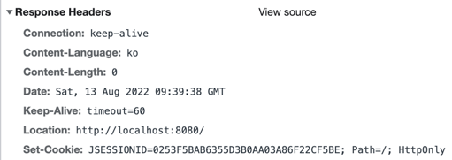

**SessionConst**

`HttpSession` 에 데이터를 보관하고 조회할 때, 같은 이름이 중복되어 사용되므로, 상수를 하나 정의했다.
```java
public class SessionConst {
    public static final String LOGIN_MEMBER = "loginMember";
}
```

**LoginController - loginV3()**

* 세션 생성 `request.getSession()` `default: true`
  * `request.getSession(true)`
    * 세션이 있으면 기존 세션 반환
    * 세션이 없으면 새로운 세션 생성 후 반환
  * `request.getSession(false)`
    * 세션이 있으면 기존 세션 반환
    * 세션이 없으면 `null` 반환
```java
@PostMapping("/login")
public String loginV3(@Valid @ModelAttribute LoginForm loginForm, BindingResult bindingResult, HttpServletRequest request) {

      if (bindingResult.hasErrors()) {
          return "login/loginForm";
      }
      
      Member loginMember = loginService.login(loginForm.getLoginId(), loginForm.getPassword());
      
      if (loginMember == null) {
          bindingResult.reject("loginFail", "아이디 또는 비밀번호가 맞지 않습니다.");
          return "login/loginForm";
      }
      
      //로그인 성공 처리 TODO
      //세션이 있으면 있는 세션 반환, 없으면 신규 세션을 생성
      HttpSession session = request.getSession(true);
      //세션에 로그인 회원 정보 보관
      session.setAttribute(SessionConst.LOGIN_MEMBER, loginMember);
      return "redirect:/";
}
```

**LoginController - logoutV3()**

`session.invalidate()` 세션을 제거한다.
```java
@PostMapping("/logout")
public String logoutV3(HttpServletRequest request) {
      HttpSession session = request.getSession(false);
      if(session != null){
          session.invalidate();
      }
      return "redirect:/";
}
```

**HomeController - homLoginV3()**

`session.getAttribute(SessionConst.LOGIN_MEMBER)` : 로그인 시점에 세션에 보관한 회원 객체를
찾는다.
```java
@GetMapping("/")
public String homLoginV3(HttpServletRequest request, Model model) {

    HttpSession session = request.getSession(false);
    if (session == null) {
        return "home";
    }

    Member loginMember = (Member) session.getAttribute(SessionConst.LOGIN_MEMBER);
    //세션에 회원 데이터가 없으면 home
    if(loginMember == null) {
        return "home";
    }

    model.addAttribute("member", loginMember);
    return "loginHome";
}
```

**HomeController - homLoginV3Spring()**

`@SessionAttribute`

스프링은 세션을 더 편리하게 사용할 수 있도록 `@SessionAttribute` 을 지원한다.

이미 로그인 된 사용자를 찾을 때는 아래와 같이 사용하면 된다.

_참고로 이 기능은 세션을 생성 하지 않는다._

`@SessionAttribute(name = SessionConst.LOGIN_MEMBER, required = false)`

```java
@GetMapping("/")
public String homLoginV3Spring(@SessionAttribute(name = SessionConst.LOGIN_MEMBER, required = false) Member member, Model model) {

    //세션에 회원 데이터가 없으면 home
    if(member == null) {
        return "home";
    }

    model.addAttribute("member", member);
    return "loginHome";
}
```

### TrackingModes
로그인을 처음 시도하면 URL이 다음과 같이 `jsessionid` 를 포함하고 있는 것을 확인할 수 있다.
```text
http://localhost:8080/;jsessionid=F59911518B921DF62D09F0DF8F83F872
```
**이것은 웹 브라우저가 쿠키를 지원하지 않을 때 쿠키 대신 URL을 통해서 세션을 유지하는 방법!**

타임리프 같은 템플릿은 엔진을 통해서 링크를 걸면 자동으로 포함해준다.

서버 입장에서 웹 브라우저가 쿠키를 지원하는지 아닌지 최초에는 판한다지 못하므로, 쿠키 값도 전달하고, URL에 jsessionid 도 함께 전달한다.

**URL 전달 방식을 끄고 항상 쿠키를 통해서만 세션을 유지**하고 싶으면 다음 옵션을 넣어주면 된다. 

이렇게 하면 URL에 `jsessionid` 가 노출되지 않는다.
```properties
server.servlet.session.tracking-modes=cookie
```

### 세션 타임아웃

글로벌 설정
```properties
# 60초
server.servlet.session.timeout=60
```

특정 세션 단위로 시간 설정
```java
session.setMaxInactiveInterval(1800); //1800초
```
세션의 타임아웃 시간은 해당 세션과 관련된 `JSESSIONID` 를 전달하는 `HTTP 요청`이 있으면 현재 시간으로 다시 초기화 된다.
이렇게 초기화 되면 세션 타임아웃으로 설정한 시간동안 세션을 추가로 사용할 수 있다.
`session.getLastAccessedTime()` : 최근 세션 접근 시간
LastAccessedTime 이후로 timeout 시간이 지나면, WAS가 내부에서 해당 세션을 제거

### 세션 정리

**세션에는 최소한의 데이터만 보관**해야 한다는 점이다. 

보관한 `데이터 용량 * 사용자 수`로 세션의 메모리 사용량이 급격하게 늘어나서 장애로 이어질 수 있다. 

추가로 세션의 시간을 너무 길게 가져가면 메모리 사용이 계속 누적 될 수 있으므로 적당한 시간을 선택하는 것이 필요하다. 

`기본이 30분`이라는 것을 기준으로 고민하면 된다.


## 서블릿 필터
요구사항을 보면 로그인 한 사용자만 상품 관리 페이지에 들어갈 수 있어야 한다.

문제는 로그인 하지 않은 사용자도 URL을 직접 호출하면 상품 관리 화면에 들어갈 수 있다는 점이다.

`http://localhost:8080/items`

상품 관리 컨트롤러에서 로그인 여부를 체크하는 로직을 하나하나 작성하면 되겠지만, 
등록, 수정, 삭제, 조회 등등 상품 관리의 모든 컨트롤러 로직에 공통으로 로그인 여부를 확이해야 한다.
더 큰 문제는 **향후 로그인과 관련된 로직이 변경될 때 마다 작성한 모든 로직을 수정해야 할수 있다....**

이렇게 애플리케이션 여러 로직에서 공통으로 관심이 있는 것을 공통 관심사(cross-cutting concern)라고 한다.

이러한 공통 관심사는 `스프링의 AOP`로도 해결 할 수 있지만, 웹과 관련된 공통 관심사는 지금부터 설명할 서블릿 필터 또는 스프링 인터셉터를 사용하는 것이 좋다.
웹과 관련된 공통 관심사를 처리할 때는 HTTP의 헤더나 URL의 정보들이 필요한데, 서블릿 필터나 스프링 인터셉터는 `HttpServletRequest` 를 제공한다.

### 필터의 흐름
필터는 서블릿(스프링의 디스패처 서블릿)이 지원하는 **수문장**이다.

**필터 흐름**
```text
HTTP 요청 -> WAS -> 필터 -> 서블릿 -> 컨트롤러
```
필터를 적용하면 필터가 호출 된 다음에 서블릿이 호출.

모든 고객의 요청 로그를 남기는 요구사항이 있다면 필터를 사용하면된다.

참고로 필터는 특정 URL 패턴에 적용할 수 있다. `*/` 이라고 적용하면 모든 요청에 필터가 적용된다.


**필터 제한**
```text
HTTP 요청 -> WAS -> 필터 -> 서블릿 -> 컨트롤러 //로그인 사용자
HTTP 요청 -> WAS -> 필터(적절하지 않은 요청이라 판단, 서블릿 호출 X) //비 로그인 사용자
```
필터에서 적절하지 않은 요청이라고 판단하면 거기서 `return;` 하면 좋다.

그래서 **로그인 여부를 체크**하기에 딱 좋다! 👍

**필터 체인**
```text
HTTP 요청 -> WAS -> 필터1(로그1) -> 필터2(로그2) -> 필터3(로그인 여부) -> 서블릿 -> 컨트롤러
```
**필터는 체인으로 구성**되는데, 중간에 필터를 자유롭게 추가할 수 있다.

예를 들어서 로그를 남기는 필터를 먼저 적용하고, 그 다음에 로그인 여부를 체크하는 필터를 만들 수 있다.

**필터 인터페이스**

필터 인터페이스를 구현하고 등록하면 

서블릿 컨테이너가 필터를 싱글톤 객체로 생성하고, 관리한다.
```java
public interface Filter { 
    default void init(FilterConfig filterConfig) throws ServletException;
    
    void doFilter(ServletRequest request, ServletResponse response, FilterChain chain) throws IOException, ServletException;
    
    default void destroy();
}
```
* `init()`: 필터 초기화 메서드, 서블릿 컨테이너가 생성될 때 호출된다.
* `doFilter()`: 고객의 요청이 올 때 마다 해당 메서드가 호출된다. 필터의 로직을 구현하면 된다.
* `destroy()`: 필터 종료 메서드, 서블릿 컨테이너가 종료될 때 호출된다.

### 서블릿 필터 -인증 체크
드디어 인증 체크 필터를 개발해보자. 

로그인 되지 않은 사용자는 상품 관리 뿐만 아니라 미래에 개발될 페이지에도 접근하지 못하도록 하자.!

**LoginCheckFilter -인증 체크 필터**
```java
@Slf4j
public class LoginCheckFilter implements Filter {

    private static final String[] whitelist = {"/", "/members/add", "/login", "/logout", "/css/*"};

    @Override
    public void doFilter(ServletRequest request, ServletResponse response, FilterChain chain) throws IOException, ServletException {
        
        HttpServletRequest httpRequest = (HttpServletRequest) request;
        String requestURI = httpRequest.getRequestURI();

        HttpServletResponse httpResponse = (HttpServletResponse) response;

        try {
          log.info("인증 체크 필터 시작{}", requestURI);
          if(isLoginCheckPath(requestURI)) {
              log.info("인증 체크 로직 실행 {}", requestURI);
              HttpSession session = httpRequest.getSession(false);
              if(session == null || session.getAttribute(SessionConst.LOGIN_MEMBER) == null) {
                  log.info("미인증 사용자 요청 {}", requestURI);
                  // 로그인으로 redirect
                  httpResponse.sendRedirect("/login?redirectURL="+requestURI);
                  return;
              }
          }
          /**
           * 다음 필터가 있으면 필터를 호출하고, 필터가 없으면 서블릿을 호출!
           * 이 로직이 없다면 다음 단계로 진행 불가능..
           */
          chain.doFilter(request, response);
          
        } catch (Exception e) {
            throw e; //예외 로깅 가능하지만, 톰캣까지 예외를 보내주어야 함
        } finally {
            log.info("인증 체크 필터 종료 {}", requestURI);
        }
    }

    /**
     * 화이트 리스트의 경우 인증 체크 X
     */
    private boolean isLoginCheckPath(String requestURI) {
        return !PatternMatchUtils.simpleMatch(whitelist, requestURI);
    }
}
```
* `httpResponse.sendRedirect("/login?redirectURL=" + requestURI);`
  * **미인증 사용자는 로그인 화면으로 리다이렉트** 한다. 그런데 **로그인 이후에 다시 홈으로 이동해버리면,
  원하는 경로를 다시 찾아가야 하는 불편함**이 있다. 예를 들어서 상품 관리 화면을 보려고 들어갔다가
  로그인 화면으로 이동하면, 로그인 이후에 다시 상품 관리 화면으로 들어가는 것이 좋다. 이런 부분이
  개발자 입장에서는 좀 귀찮을 수 있어도 사용자 입장으로 보면 편리한 기능이다. 이러한 기능을 위해
  현재 **요청한 경로인 requestURI 를 /login 에 쿼리 파라미터로 함께 전달**한다. 물론 /login
  컨트롤러에서 로그인 성공시 해당 경로로 이동하는 기능은 추가로 개발해야 한다.
* `return;`
  * 여기가 중요하다. 필터를 더는 진행하지 않는다. 이후 필터는 물론 서블릿, 컨트롤러가 더는
  호출되지 않는다. **앞서 redirect 를 사용했기 때문에 redirect 가 응답으로 적용되고 요청이 끝난다.**

```java
@Configuration
public class WebConfig implements WebMvcConfigurer {

  @Bean
  public FilterRegistrationBean loginCheckFilter() {
    FilterRegistrationBean<Filter> filterFilterRegistrationBean = new FilterRegistrationBean<>();
    filterFilterRegistrationBean.setFilter(new LoginCheckFilter());
    filterFilterRegistrationBean.setOrder(2);
    filterFilterRegistrationBean.addUrlPatterns("/*");

    return filterFilterRegistrationBean;
  }
}
```
* `setFilter(new LoginCheckFilter())` : 로그인 필터를 등록한다.
* `setOrder(2)` : 순서를 2번으로 잡았다.
* `addUrlPatterns("/*")` : 모든 요청에 로그인 필터를 적용한다. 

LoginController - loginV4()
```java
@PostMapping("/login")
public String loginV4(@Valid @ModelAttribute LoginForm loginForm, BindingResult bindingResult,
                      @RequestParam(defaultValue = "/") String redirectURL,
                      HttpServletRequest request) {

    if (bindingResult.hasErrors()) {
        return "login/loginForm";
    }

    Member loginMember = loginService.login(loginForm.getLoginId(), loginForm.getPassword());

    if (loginMember == null) {
        bindingResult.reject("loginFail", "아이디 또는 비밀번호가 맞지 않습니다.");
        return "login/loginForm";
    }

    //로그인 성공 처리 TODO
    //세션이 있으면 있는 세션 반환, 없으면 신규 세션을 생성
    HttpSession session = request.getSession(true);
    //세션에 로그인 회원 정보 보관
    session.setAttribute(SessionConst.LOGIN_MEMBER, loginMember);

    return "redirect:"+redirectURL;
}
```
로그인 체크 필터에서, 미인증 사용자는 요청 경로를 포함해서 `/login` 에 `redirectURL` 요청 파라미터를
추가해서 요청했다. 

이 값을 사용해서 로그인 성공시 해당 경로로 고객을 `redirect` 한다.

**서블릿 필터**를 잘 사용한 덕분에 로그인 하지 않은 사용자는 나머지 경로에 들어갈 수 없게 되었다. 공통
관심사를 서블릿 필터를 사용해서 해결한 덕분에 **향후 로그인 관련 정책이 변경되어도 이 부분만 변경하면
된다.**

### 스프링 인터셉터
`스프링 인터셉터`도 서블릿 필터와 같이 **웹과 관련된 공통 관심사항을 효과적으로 해결**할 수 있는 기술
* 서블릿이 제공
  * 서블릿 필터
* 스프링 MVC 제공
  * 스프링 인터셉터

**스프링 인터셉터 흐름**
```text
HTTP 요청 -> WAS -> 필터 -> 서블릿 -> 스프링 인터셉터 -> 컨트롤러
```
* 스프링 인터셉터는 디스패처 서블릿과 컨트롤러 사이에서 컨트롤러 호출 직전에 호출
* 스프링 인터셉터는 스프링 MVC가 제공하는 기능이기 때문에 결국 디스패처 서블릿 이후에 등장
  * 스프링 MVC의 시작점이 디스패처 서블릿이라고 생각해보면 이해가 될것이다.!
* 스프링 인터셉터에도 URL 패턴을 적용할 수 있는데, 서블릿 URL 패턴과는 다르고, 매우 정밀하게 설정 할 수 있다.

**스프링 인터셉터 제한**

**인터셉터에서 적절하지 않은 요청이라고 판단하면 거기에서 끝**을 낼 수도 있다. 그래서 로그인 여부를
체크하기에 딱 좋다.
```text
HTTP 요청 -> WAS -> 필터 -> 서블릿 -> 스프링 인터셉터 -> 컨트롤러 //로그인 사용자
HTTP 요청 -> WAS -> 필터 -> 서블릿 -> 스프링 인터셉터(적절하지 않은 요청이라 판단, 컨트롤러 호출 X) // 비 로그인 사용자
```

**스프링 인터셉터 체인**

스프링 인터셉터는 체인으로 구성되는데, 중간에 인터셉터를 자유롭게 추가할 수 있다. 

예를 들어서 로그를 남기는 인터셉터를 먼저 적용하고, 그 다음에 로그인 여부를 체크하는 인터셉터를 만들 수 있다.
```text
HTTP 요청 -> WAS -> 필터 -> 서블릿 -> 인터셉터1 -> 인터셉터2 -> 컨트롤러
```

> 지금까지 내용을 보면 서블릿 필터와 호출 되는 순서만 다르고, 제공하는 기능은 비슷해 보인다. 앞으로
설명하겠지만, **스프링 인터셉터는 서블릿 필터보다 편리하고, 더 정교하고 다양한 기능을 지원**한다.

**스프링 인터셉터 인터페이스**

스프링의 인터셉터를 사용하려면 `HandlerInterceptor` 인터페이스를 구현하면 된다.
```java
public interface HandlerInterceptor {
    
	default boolean preHandle(HttpServletRequest request, HttpServletResponse response, Object handler)
			throws Exception {
		return true;
	}
    
	default void postHandle(HttpServletRequest request, HttpServletResponse response, Object handler,
			@Nullable ModelAndView modelAndView) throws Exception {
	}
    
	default void afterCompletion(HttpServletRequest request, HttpServletResponse response, Object handler,
			@Nullable Exception ex) throws Exception {
	}

}
```
* 서블릿 필터의 경우 단순하게 `doFilter()` 하나만 제공된다. 
* 인터셉터는 컨트롤러 호출 전( `preHandle` ), 호출 후( `postHandle` ), 요청 완료 이후( `afterCompletion` )와 같이 단계적으로 잘 세분화 되어 있다.
* 서블릿 필터의 경우 단순히 `request` , `response` 만 제공했지만, 인터셉터는 어떤 컨트롤러( `handler` )가
호출되는지 호출 정보도 받을 수 있다. 그리고 어떤 `modelAndView` 가 반환되는지 응답 정보도 받을 수
있다.

**스프링 인터셉터 호출 흐름**

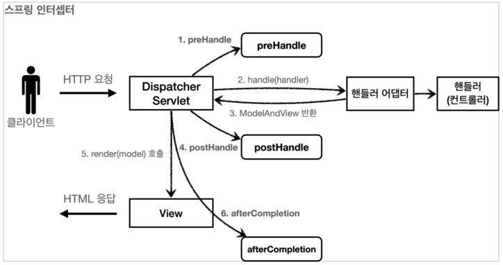

**정상 흐름**

* `preHandle` : 컨트롤러 호출 전에 호출된다. (더 정확히는 핸들러 어댑터 호출 전에 호출된다.)
  * `preHandle` 의 응답값이 `true` 이면 다음으로 진행하고, `false` 이면 더는 진행하지 않는다. 
  `false` 인 경우 나머지 인터셉터는 물론이고, 핸들러 어댑터도 호출되지 않는다. 그림에서 1번에서 끝이
  나버린다.
* `postHandle` : 컨트롤러 호출 후에 호출된다. (더 정확히는 핸들러 어댑터 호출 후에 호출된다.)
* `afterCompletion` : 뷰가 렌더링 된 이후에 호출된다.

**스프링 인터셉터 예외 상황**

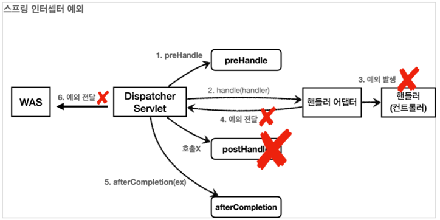

**예외가 발생시**

* `preHandle` : 컨트롤러 호출 전에 호출된다.
* `postHandle` : 컨트롤러에서 예외가 발생하면 `postHandle` 은 호출되지 않는다.
* `afterCompletion` : `afterCompletion` 은 항상 호출된다. 이 경우 예외( `ex` )를 파라미터로 받아서 어떤
예외가 발생했는지 로그로 출력할 수 있다.

**`afterCompletion` 은 예외가 발생해도 호출된다.**
* 예외가 발생하면 `postHandle()` 는 호출되지 않으므로 **예외와 무관하게 공통 처리를 하려면 `afterCompletion()` 을 사용**해야 한다.
* 예외가 발생하면 `afterCompletion()` 에 예외 정보( `ex` )를 포함해서 호출된다.

> 인터셉터는 스프링 MVC 구조에 특화된 필터 기능을 제공한다.
> 특별히 필터를 반드시 사용해야 하는 상황이 아니라면 인터셉터를 사용하는 것이 더 편리하다.

### 스프링 인터셉터 - 요청 로그
**LogInterceptor - 요청 로그 인터셉터**
```java
@Slf4j
public class LogInterceptor implements HandlerInterceptor {

    public static final String LOG_ID = "logId";

    @Override
    public boolean preHandle(HttpServletRequest request, HttpServletResponse response, Object handler) throws Exception {

        String requestURI = request.getRequestURI();
        String uuid = UUID.randomUUID().toString();

        request.setAttribute(LOG_ID, uuid);

        //@RequestMapping: HandlerMethod
        //정적 리소스: ResourceHttpRequestHandler
        if(handler instanceof HandlerMethod) {
            HandlerMethod hm = (HandlerMethod) handler; //호출할 컨트롤러 메서드의 모든 정보가 포함되어 있다.
        }

        log.info("REQUEST [{}] [{}] [{}]",uuid, requestURI, handler);

        return true;
    }

    @Override
    public void postHandle(HttpServletRequest request, HttpServletResponse response, Object handler, ModelAndView modelAndView) throws Exception {
        log.info("postHandle=[{}]", modelAndView);
    }

    @Override
    public void afterCompletion(HttpServletRequest request, HttpServletResponse response, Object handler, Exception ex) throws Exception {
        String requestURI = request.getRequestURI();
        Object uuid = request.getAttribute(LOG_ID);
        log.info("REQUEST [{}] [{}] [{}]",uuid, requestURI, handler);

        if(ex != null) {
            log.error("afterCompletion error!!", ex);
        }
    }
}
```
* `request.setAttribute(LOG_ID, uuid)`
  * 서블릿 필터의 경우 지역변수로 해결이 가능하지만, 스프링 인터셉터는 호출 시점이 완전히 분리되어
  있다. 따라서 `preHandle` 에서 지정한 값을 `postHandle` , `afterCompletion` 에서 함께 사용하려면
  어딘가에 담아두어야 한다. `LogInterceptor` 도 싱글톤 처럼 사용되기 때문에 맴버변수를 사용하면
  위험하다. 따라서 request 에 담아두었다. 이 값은 `afterCompletion` 에서
  .request.getAttribute(LOG_ID)` 로 찾아서 사용한다.
* `return true`
  * `true` 면 정상 호출이다. 다음 인터셉터나 컨트롤러가 호출된다

**HandlerMethod**

**핸들러 정보는 어떤 핸들러 매핑을 사용하는가에 따라 달라진다.** 스프링을 사용하면 일반적으로
`@Controller` , `@RequestMapping` 을 활용한 핸들러 매핑을 사용하는데, 이 경우 핸들러 정보로
`HandlerMethod` 가 넘어온다.

**ResourceHttpRequestHandler**

`@Controller` 가 아니라 `/resources/static` 와 같은 정적 리소스가 호출 되는 경우
`ResourceHttpRequestHandler` 가 핸들러 정보로 넘어오기 때문에 타입에 따라서 처리가 필요하다.

**postHandle, afterCompletion**

종료 로그를 `postHandle` 이 아니라 `afterCompletion` 에서 실행한 이유는, **예외가 발생한 경우
`postHandle` 가 호출되지 않기 때문**이다. `afterCompletion` 은 예외가 발생해도 호출 되는 것을 보장한다.

### 스프링 인터셉터 - 인증 체크
서블릿 필터에서 사용했던 인증 체크 기능을 스프링 인터셉터로 개발해보자.

**LoginCheckInterceptor**

인증이라는 것은 컨트롤러 호출 전에만 호출되면 된다. 
따라서 `preHandle` 만 구현하면 된다.
```java
@Slf4j
public class LoginCheckInterceptor implements HandlerInterceptor {
    @Override
    public boolean preHandle(HttpServletRequest request, HttpServletResponse response, Object handler) throws Exception {
  
      String requestURI = request.getRequestURI();
  
      log.info("인증 체크 인터셉터 실행 {}", requestURI);
  
      HttpSession session = request.getSession();
  
      if (session == null || session.getAttribute(SessionConst.LOGIN_MEMBER) == null) {
        log.info("미인증 사용자 요청");
  
        //로그인으로 redirect
        response.sendRedirect("/login?redirectURL=" + requestURI);
        return false;
      }
      return true;
    }
}
```

**WebConfig - 인터셉터 등록**
```java
@Configuration
public class WebConfig implements WebMvcConfigurer {
    @Override
    public void addInterceptors(InterceptorRegistry registry) {
        registry.addInterceptor(new LogInterceptor())
                .order(1)
                .addPathPatterns("/**")
                .excludePathPatterns("/css/**", "/*.ico", "/error");
    
        registry.addInterceptor(new LoginCheckInterceptor())
                .order(2)
                .addPathPatterns("/**")
                .excludePathPatterns("/", "/members/add", "/login", "/logout",
                        "/css/**", "/*.ico", "/error");
    }
}
```
* `WebMvcConfigurer` 가 제공하는 `addInterceptors()` 를 사용해서 인터셉터를 등록할 수 있다.
* `registry.addInterceptor(new LogInterceptor())` : 인터셉터를 등록한다.
* `order(숫자)` : 인터셉터의 호출 순서를 지정한다. 낮을 수록 먼저 호출된다.
* `addPathPatterns("/**")` : 인터셉터를 적용할 URL 패턴을 지정한다.
* `excludePathPatterns("/css/**", "/*.ico", "/error")` : 인터셉터에서 제외할 패턴을 지정한다.

**PathPattern 공식 문서**

* https://docs.spring.io/spring-framework/docs/current/javadoc-api/org/springframework/web/util/pattern/PathPattern.html
```text
? 한 문자 일치
* 경로(/) 안에서 0개 이상의 문자 일치
** 경로 끝까지 0개 이상의 경로(/) 일치
{spring} 경로(/)와 일치하고 spring이라는 변수로 캡처
{spring:[a-z]+} matches the regexp [a-z]+ as a path variable named "spring"
{spring:[a-z]+} regexp [a-z]+ 와 일치하고, "spring" 경로 변수로 캡처
{*spring} 경로가 끝날 때 까지 0개 이상의 경로(/)와 일치하고 spring이라는 변수로 캡처

/pages/t?st.html — matches /pages/test.html, /pages/tXst.html but not /pages/toast.html
/resources/*.png — matches all .png files in the resources directory
/resources/** — matches all files underneath the /resources/ path, including /
resources/image.png and /resources/css/spring.css
/resources/{*path} — matches all files underneath the /resources/ path and
captures their relative path in a variable named "path"; /resources/image.png
will match with "path" → "/image.png", and /resources/css/spring.css will match
with "path" → "/css/spring.css"
/resources/{filename:\\w+}.dat will match /resources/spring.dat and assign the
value "spring" to the filename variable
```

> `스프링 인터셉터`가 개발자 입장에서 훨씬 편리하다는 것을 코드로 이해했을 것이다. 
> 특별한 문제가 없다면 인터셉터를 사용하는 것이 좋다.


### ArgumentResolver 활용
<a href="https://github.com/ssosee/springmvc#%EC%9A%94%EC%B2%AD-%EB%A7%A4%ED%95%91-%ED%95%B8%EB%93%A4%EB%9F%AC-%EC%96%B4%EB%8C%91%ED%84%B0-%EA%B5%AC%EC%A1%B0">요청 매칭 핸들러 어댑터 구조</a>

**@Login 애노테이션 생성**
```java
@Target(ElementType.PARAMETER)
@Retention(RetentionPolicy.RUNTIME)
public @interface Login {
}
```
* `@Target(ElementType.PARAMETER)` : 파라미터에만 사용
* `@Retention(RetentionPolicy.RUNTIME)` : 리플렉션 등을 활용할 수 있도록 런타임까지 애노테이션 정보가 남아있음

**HomeController - 추가**
```java
@GetMapping("/")
public String homLoginV3ArgumentResolver(@Login Member loginMember, Model model) {

    //세션에 회원 데이터가 없으면 home
    if(loginMember == null) {
        return "home";
    }

    model.addAttribute("member", loginMember);
    return "loginHome";
}
```

**LoginMemberArgumentResolver 생성**
```java
@Slf4j
public class LoginMemberArgumentResolver implements HandlerMethodArgumentResolver {

    @Override
    public boolean supportsParameter(MethodParameter parameter) {
        log.info("supportParameter 실행");

        boolean hasLoginAnnotation = parameter.hasParameterAnnotation(Login.class);
        boolean hasMemberType = Member.class.isAssignableFrom(parameter.getParameterType());

        return hasLoginAnnotation && hasMemberType;
    }

    @Override
    public Object resolveArgument(MethodParameter parameter, ModelAndViewContainer mavContainer, NativeWebRequest webRequest, WebDataBinderFactory binderFactory) throws Exception {
        log.info("resolveArgument 실행");

        HttpServletRequest request = (HttpServletRequest) webRequest.getNativeRequest();
        HttpSession session = request.getSession(false);

        if (session == null) {
            return null;
        }

        return session.getAttribute(SessionConst.LOGIN_MEMBER);
    }
}
```
* `supportsParameter()` : `@Login` 애노테이션이 있으면서 `Member` 타입이면 해당 `ArgumentResolver` 가 사용된다.
* `resolveArgument()` : 컨트롤러 호출 직전에 호출 되어서 필요한 파라미터 정보를 생성해준다. 
여기서는 세션에 있는 로그인 회원 정보인 `member` 객체를 찾아서 반환해준다. 
이후 스프링MVC는 컨트롤러의 메서드를 호출하면서 여기에서 반환된 `member` 객체를 파라미터에 전달해준다.

**WebMvcConfigurer에 설정 추가**
```java
@Configuration
public class WebConfig implements WebMvcConfigurer {
   @Override
   public void addArgumentResolvers(List<HandlerMethodArgumentResolver> resolvers) {
      resolvers.add(new LoginMemberArgumentResolver());
   }
 //...
}
```

실행해보면, 결과는 동일하지만, 더 편리하게 로그인 회원 정보를 조회할 수 있다. 이렇게
`ArgumentResolver` 를 활용하면 공통 작업이 필요할 때 컨트롤러를 더욱 편리하게 사용할 수 있다.
